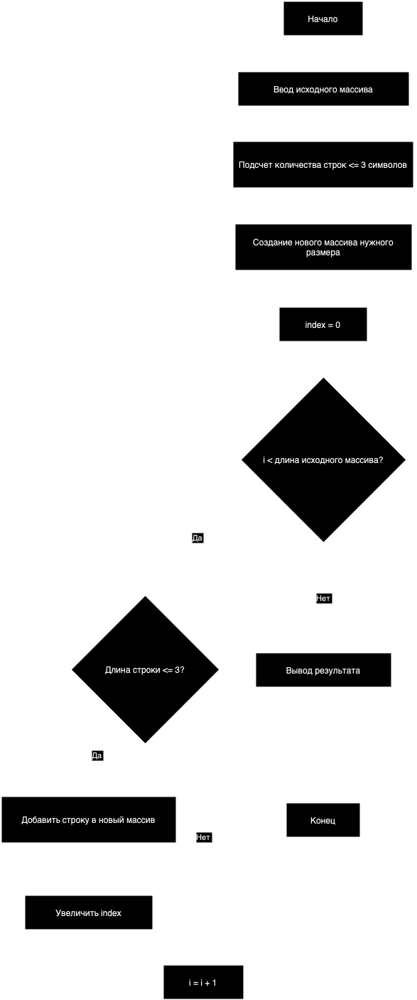

# Итоговая проверочная работа

## Задача
Написать программу, которая из имеющегося массива строк формирует новый массив из строк, длина которых меньше, либо равна 3 символам. Первоначальный массив можно ввести с клавиатуры, либо задать на старте выполнения алгоритма.

## Алгоритм решения
1. Делаем перебор значений из исходного массива
2. Проверяем каждое значение на соответствие условию: длина строки меньше или равна 3
3. Если строка удовлетворяет условию, то добавляем её в новый массив
4. Повторяем пункты 2 и 3 до тех пор, пока не проверим все элементы исходного массива
5. Возвращаем получившийся массив как результат

## Блок-схема алгоритма

## Примеры
* `["Hello", "2", "world", ":-)"]` → `["2", ":-)]`
* `["1234", "1567", "-2", "computer science"]` → `["-2"]`
* `["Russia", "Denmark", "Kazan"]` → `[]`
